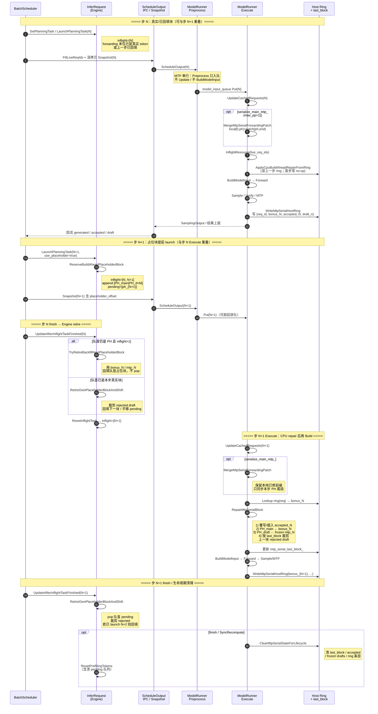

# Build-Ahead + MTP 串行支持方案

## 1. 背景与目标

### 1.1 问题

慢路径（`max_depth=1`）每步等采样结果回流后再 launch 下一步。build-ahead（FastPath，`max_depth=2`）在步 N 采样完成前就 launch 步 N+1，以重叠调度与计算。

引入 MTP（`MTP_STEP_NUM>0`）后，步 N+1 的末位 token 与 draft 在 launch 时未知，且 MTP verify 与主模型 forward 在 Executor 侧串行。需要一套 **占位 → 修补 → 裁剪** 机制，并保证：

1. 与慢路径数值一致（E2E 金标 token / md5）。
2. 慢路径行为不被 ahead 专用逻辑改写（`IsEnabledAtStartup()` 门控）。
3. split-fuse / prefix cache / block 压力 / recompute 可正确工作。

### 1.2 非目标

- 不修改 `PrefixCacheManager::AppendFilledCachedBlock` 的 SWA merge 语义（曾尝试的 Transfer/window 改写已回退）。
- 不把 `MergeMtpSerialForwardingPatch` 挂到 ahead 门控上（ahead 常用 `max_pp=1`，该 merge 由 `serialize_main_mtp_` 控制）。

---

## 2. 总体架构

```
┌──────────── Engine (BatchScheduler / InferRequest) ────────────┐
│  depth=2 launch → 预留 [main|draft×M] 占位块 (-1)               │
│  snapshot 序列化 → IPC                                          │
│  retire：回填 / 裁剪 rejected draft / 平移 pending 下标          │
└─────────────────────────────┬──────────────────────────────────┘
                              │ ScheduleOutput (+ live_req_ids)
┌─────────────────────────────▼──────────────────────────────────┐
│  Executor (ModelRunner / ExecutorRuntime)                       │
│  MergeMtpSerialForwardingPatch：保留本地已修前缀 + 同步占位尾段 │
│  ApplyCpuBuildAheadRepairFromRing：读 host ring 修补占位块      │
│  BuildModelInput → Forward → Sample/Verify/MTP                  │
│  WriteMtpSerialHostRing：写 bonus / accepted 供下一步 repair    │
└────────────────────────────────────────────────────────────────┘
```

### 2.1 慢路径 vs build-ahead

| 维度 | 慢路径 | build-ahead |
|------|--------|-------------|
| inflight 深度 | 1 | 2 |
| decode 末位 | 直接 append 真实 token | 占位块，Executor CPU repair |
| batch 重排 | `GetDecodeTokenNumThreshold` 启发式 | `IsPaged` / `GetInputIdsLength` 对齐 |
| recompute drain | 仅 `running_reqs` | 全量 `async_recomputed_reqs` |
| decode 压力 recompute 门控 | 全局 async_stoped/recomputed 为空 | 仅看本 req 是否 async_stoped |
| SyncRecompute 清 SWA | 否（保持旧行为） | 是 |

门控统一：`FastPathController::GetInstance().IsEnabledAtStartup()`。

---

## 2.2 完整时序图（build-ahead + MTP 串行，depth=2）

稳态 decode：Engine 在步 N 采样回流前就 launch 步 N+1（占位块）；Executor 在 Execute 线程串行完成
Update → Repair → Build → Forward → Sample/Verify/MTP → 写 host ring。



### 数据流对照（单 req，M=2）

```text
时间 →
Engine forwarding:
  step N   launch:  [... cached | t_N | d0 | d1 ]
  step N+1 launch:  [... cached | t_N | d0 | d1 | PH | PH | PH ]
  retire N:         [... cached | t_N | d0 | d1 | bonus_N | mtp0 | mtp1 ]  ← TryRetire 回填
  retire N+1:       [... | bonus_N | acc... | bonus_{N+1} | ... ]         ← RetireOwn 裁剪+回填

Executor (步 N+1 Build 前):
  ring[N] = (bonus_N, accepted_n, ...)
  Repair: PH 块 → [bonus_N | mtp0 | mtp1]，并裁掉上一块被拒 draft
```

---

## 3. Engine：占位块生命周期

### 3.1 布局

每块：`[main | draft₀ … draft_{M-1}]`，launch 时全部为 `kFastPathPlaceholderTokenId`（-1）。

```
forwarding_tokens:
  [ ... cached ... | PH_main | PH_d0 | PH_d1 | ... ]
                     ^
                     pending_placeholder_positions_.back()
                     pending_placeholder_draft_nums_ = M
```

### 3.2 时序（depth=2，MTP M=2）

```
时间 →
  step k-1 launch (真实或已回填)
  step k   launch (占位块)     ← Engine 提前 launch
  step k-1 finish / retire
       ├─ TryRetireBackfillNextPlaceholderBlock
       │    队首仍是 PH 且 inflight>1 → 用 bonus_{k-1}/mtp_{k-1} 回填队首，不 pop
       └─ （若队首已是真实值）走 RetireOwn...
  step k   finish / retire
       └─ RetireOwnPlaceholderBlockAndShift
            裁剪 rejected draft → 回填下一块 → 平移后续 pending 下标
```

辅助函数（`infer_request.cpp`）：

- `ReserveBuildAheadPlaceholderBlock` — decode launch 预留
- `AppendDecodeTokensWithoutPlaceholder` — 慢路径 / 防御分支
- `TryRetireBackfillNextPlaceholderBlock` — 步 k-1 回填
- `RetireOwnPlaceholderBlockAndShift` — 步 k 裁剪+平移

### 3.3 split-fuse 末块判定

`IsSplitPrefillStep()` 读 **oldest** inflight。depth=2 时 oldest 可能是上一 chunk，不能用来判定「本次 launch 是否末块」。

改为用本次 `new_inflight.workload` 自身：

```text
is_last = prefill_token_num + prefill_start_offset >= prefilling_tokens_.size()
```

末块 → `ForwardStepKind::kPrefill`（采样）；中间 → `kPrefillChunkMid`（仅写 KV）。

### 3.4 序列化快照

`InferRequestSerializationSnapshot` 在 launch 时刻深拷贝 `forwarding_tokens` 等，避免 depth=2 下 N+1 launch 污染 N 的 IPC 载荷。`placeholder_offset_in_snapshot` 供 Executor 定位占位块。

---

## 4. Executor：MTP 串行 repair

### 4.1 为何串行 + host ring

MTP>0 时 Sample/Verify/MTP 与慢路径同序，在 Execute 线程内完成；Preprocess 只入队 schedule，不做 `BuildModelInput`。因此不走 device ring / CUDA replace kernel，改用 **host ring**：

```text
[count, (req_id, bonus_token, accepted_n, forward_draft_n)*]
```

### 4.2 关键路径

1. `WriteMtpSerialHostRingAfterGenerationState`：本批有 generated 的 req 覆写；**未入本批的旧条目保留**（block 压力下 Recover-to-decode 仍可 repair）。
2. `ApplyCpuBuildAheadRepairFromRing` → `RepairMtpSerialBlock`：
   - 插入/覆写 accepted draft
   - 回填 main + frozen MTP drafts
   - 按 `mtp_serial_last_block_` 裁剪上一块 rejected draft（**不能**信 IPC patch 里滞后的 `kv_cached_token_num`）
3. `ClearMtpSerialStateForLifecycle`：finish / SyncRecompute 时清本地状态与 ring 条目。

### 4.3 MergeMtpSerialForwardingPatch

Engine 快照会整表覆盖 Executor 本地已修补的 `forwarding_tokens`。merge 策略：

```text
local:  [已修前缀 ... | ...]
patch:  [可能陈旧 ... | PH 尾段]
result: local[0, ph) + patch[ph, end)
```

由 `serialize_main_mtp_`（`max_pp>1`）触发，**不要**用 `IsEnabledAtStartup()` 门控。

---

## 5. 调度与资源

### 5.1 ReorderInferRequests（review 隔离）

入口按 ahead 门控分发：

- `ReorderInferRequestsSlowPath` — 恢复 master 启发式（`GetDecodeTokenNumThreshold`）
- `ReorderInferRequestsBuildAhead` — 与 `GetInputIdsLength` / compressor `IsPaged` 对齐  
  例：同 dp 下 `[prefill q_len>1] → [占位 input_ids_len=0] → [paged decode]`，避免占位步排到 paged 之后触发 DSv4 断言
- `ResetLogitsOffsetsAfterReorder` — 共用

### 5.2 live_req_ids

Engine `FillLiveReqIds` 汇总 running / decoding / waiting / transfer / async_recomputed。Executor `FreeInactive` 只释放 **不在 live 集合** 的资源，避免把「仍 live 但本轮未入 compute batch」的 compressor slot 误释放。

### 5.3 Block 压力

- 有 block 释放 → `RecoverAsyncRecomputedRequests`（回 decode，高效）
- 无释放 + ahead → drain 全部 `async_recomputed_reqs`
- ahead 下 decode 压力 recompute 门控只看本 req 的 `async_stoped`，避免被其它 req 的全局 stop 挡住导致永远不 recompute、host ring 与 q_len 失配

---

## 6. 改动清单（按模块）

| 模块 | 改动要点 |
|------|----------|
| `infer_request` | 占位 FIFO、retire/launch 辅助、末块判定、`ForwardStepKind` |
| `infer_stage` | `ForwardStepKind`、host ring 辅助函数 |
| `schedule_output` | snapshot、`live_req_ids`、序列化 |
| `model_builder` | Slow/Ahead 重排隔离 |
| `model_runner` | host ring 写/读/清、CPU repair、MTP 串行 Execute |
| `executor_runtime` | `MergeMtpSerialForwardingPatch` |
| `continuous_batching` | ahead 门控的 recompute drain / 门控 / SWA clear |
| `batch_scheduler` | `FillLiveReqIds` |
| `inflight_resource` / compressor | `FreeInactive(live_req_ids)` |
| `prefix_cache_manager` | **不改** `AppendFilledCachedBlock`（已回退） |

---

## 7. 验收要点

- 慢路径：行为与门控外逻辑保持旧语义。
- ahead + MTP=0 / MTP=2：单请求与慢路径 token 一致（见 `scripts/e2e/fastpath_mtp/`）。
- block 压力（如 blocks=256）+ prefix + splitfuse：不出现 `q_len=0` / MQA `meta_idx` 断言。
- 单元测试：`infer_request_test`、`model_runner_test`、`schedule_output_test` 等。

---

## 8. Review 阅读顺序建议

1. 本文 §2–§4（占位与 repair 时序）
2. `model_builder.h`：`ReorderInferRequests*` 三分法
3. `infer_request.cpp`：四个 private 辅助 + `LaunchPlanningTask` / `UpdateAfterInflightTaskFinished`
4. `model_runner.cpp`：`RepairMtpSerialBlock` → Write/Apply/Clear host ring
5. `continuous_batching.cpp`：所有 `IsEnabledAtStartup()` 分支（新增注释，旧慢路径注释尽量保留）
